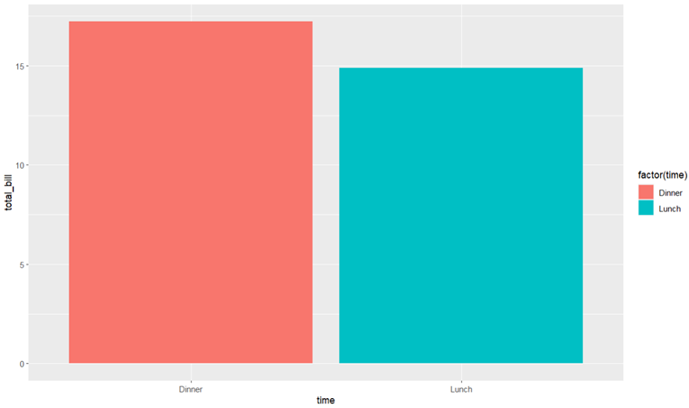
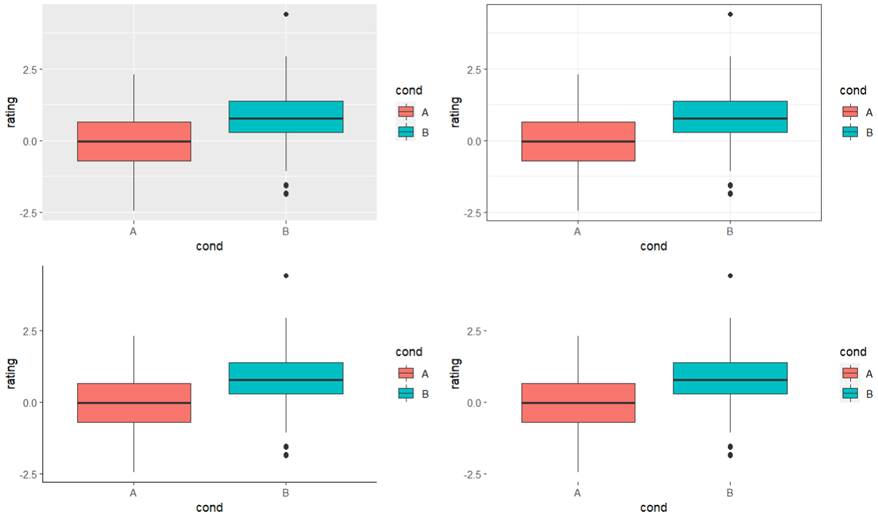

# Easy R     （The easy beginning of R language.）

# 1.R语言基础
## 1.1R语言介绍与软件安装
### 1.1.1R语言介绍
R语言是一种自由软体程式语言与操作环境，主要用于统计分析、绘图以及数据挖掘。R语言来自S语言，是S语言的一个变种。用户可以用R来进行一些基本的统计检验，构建线性及非线性的模型，对时间序列加以分析，或对数据进行分类与聚类分析。R的另一强项是绘图功能，画出的图表能够达到专业出版物的要求，也可加入数学符号。计算强度较大时，用户可在程序中嵌入C、C++以及FORTRAN语言以帮助运算。
### 1.1.2安装
Windows系统下的R语言安装，在[R](https://www.r-project.org/)或者国内的镜像网站中下载软件安装包，选择最新的安装版本即可。

[RStudio](https://www.rstudio.com/)是功能相较于原始R软件更加强大的图形用户界面，在安装RStudio前需要安装至少一个版本的R语言才能正常使用。RStudio基础界面如下所示，可以按照功能分为四个区域：左上角为文本区，常用来展示变量内的数据或函数的代码，也可以编辑文本或脚本；左下角为命令行区，由于R语言是一种脚本语言的形式，不需要编译，所以命令行区可以运行简单的单行代码，也可以运行代码块。除此之外还可以运行终端代码；右上角区为信息区，常用于展示变量函数或者历史记录等；右下角是展示区，常用于展示可视化结果，帮助文本等。


## 1.2R语言基础内容
### 1.2.1包的安装与加载
R提供了很多可以直接调用的功能，这些基础的功能是R自带的。R不仅仅只具备基本的某些功能，其还可以通过可选模块的下载和安装来进行实现更多的功能。
```R
install.packages("Packagename")
library(Packagename)
```
### 1.2.2赋值
R语言有两种赋值符号，分别是“=“和”<-“，两个符号在赋值功能上是完全一致的，但是在函数的使用中，定义全局变量只能使用”<-“。
### 1.2.3数据类型
R语言数据类型可以大致分为下方四种，其中，数值型与字符型较好理解不做解释。逻辑型是R语言用于逻辑计算的数据类型，常用于条件判断，只包含“TRUE”和“FALSE”两种类型。特殊值是由于数据等原因产生的特殊值。R中的无定义数NaN表示，即“Not a Number(非数)”。 在R中，R实际上是把NaN视作一个数的，当其参与运算时，返回结果总是NaN，使用is.nan()函数来检测计算结果有无定义。NA表示缺失值，即“Missing value”，是“not available”的缩写，可以用is.na()来判别。无穷大用Inf表示(即Infinity，无穷大)，负无穷表示为-Inf。要检查一个数是否为无穷，可以使用is.finite()或者is.infinite()。NA代表位置上的值为空，NULL代表连位置都没有，变量为空，其长度为0，也可以用is.null()判别。
```R
a <- c(1, 2, 5, 3, 6, -2, 4) #数值型
b <- c("one", "two", "three") #字符型
c <- c(TRUE, FALSE) #逻辑型
d <- c(NaN, NA, Inf, NULL)  #特殊值
```
## 1.3R语言数据结构
R语言的数据结构可以分为六种，包括向量（Vector）、矩阵（Matrix）、数组（Array）、因子（Factor）、数据框（Data.Frame）、列表（List）。这些数据结构可以在R语言中生成，也可以通过导入外界数据转换而成。
### 1.3.1向量
向量是用于存储数值型（Numeric）、字符型（character）或逻辑型（logical）数据的一维数组。执行组合功能的函数c()可用来创建向量。单个向量中的数据必须拥有相同的类型或模式（数值型、字符型或逻辑型），当单个向量中拥有不同的类型的数据时，如同时存在数值型和字符型数据时，会转换成字符型向量。

以数值型向量为例，向量可以通过以下三种方式生成：
```R
a=c(1,2,3,4,5)
b=1:5
c=seq(from=1,to=5,by=1)
常用函数：
a=c(1,2,3,4,5)
length(a)#长度
[1] 5
sum(a)#求和
[1] 15
mean(a)#求均值
[1] 3
rep(a,2)#复制
[1] 1 2 3 4 5 1 2 3 4 5
```

### 1.3.2矩阵
矩阵（Matrix）是最常见的二维数据结构之一，二维分别代表行和列。矩阵中每一列的数据是相同的，通常是数值型，偶尔也会用到全是字符串的字符型矩阵。当矩阵中同时存在数值型和字符型数据时，会转换成字符型矩阵

矩阵的数据可以进行多种操作，其生成方式也有很多种，常见的方法是根据向量生成矩阵：
```R
data<-rnorm(15) #生成向量
matrix(data,nrow=5) #按照列填充
[,1]       [,2]       [,3]
[1,]  0.4441859  0.3935345  0.6544248
[2,]  0.9271638 -0.1542035 -0.3712963
[3,] -1.5015829 -0.9366882 -1.0757627
[4,] -1.4611287 -1.6152053  1.0676820
[5,]  0.8882970 -0.4488886  1.4495640
matrix(data,nrow=5,byrow = T)#按照行填充
[,1]       [,2]       [,3]
[1,] 0.82162953  1.0286478 -0.2754075
[2,] 0.49663266 -1.6368543 -0.3505872
[3,] 0.01179141  0.4030063 -1.1596808
[4,] 1.98627585 -0.3946970  0.2381211
[5,] 0.45055860 -0.5877568  0.8637213
```
常用函数（除此之外还有大量的矩阵计算函数）：

```R
data
           [,1]      [,2]       [,3]
[1,] -1.1832075 -1.186129 -1.3719325
[2,] -0.6651334 -1.890352  1.8733599
[3,]  1.4455362 -0.453745  0.1370088
[4,] -1.0078466  1.771817  0.7545562
[5,] -0.9555193  2.609297 -1.1188567
data*3
          [,1]      [,2]       [,3]
[1,] -3.549623 -3.558387 -4.1157974
[2,] -1.995400 -5.671055  5.6200796
[3,]  4.336608 -1.361235  0.4110265
[4,] -3.023540  5.315451  2.2636687
[5,] -2.866558  7.827892 -3.3565702
rowSums(data)
[1] -3.7412690 -0.6821253  1.1288000  1.5185266
[5]  0.5349211
colSums(data)
[1] -2.3661708  0.8508885  0.2741357

#apply函数主要由三部分构成：数据，行列指向（1表示按行，2表示按列），计算函数
apply(data,1,mean)
[1] -1.2470897 -0.2273751  0.3762667  0.5061755
[5]  0.1783070
apply(data,2,function(x)sum(x))
[1] -2.3661708  0.8508885  0.2741357

```
### 1.3.3数据框
数据框（Data.Frame）每一列内的数据类型是相同的，列之间的数据可以不同.

数据框的生成：
```R
> a = data.frame(id=c("age","gender","height","weight"),value1=c(20,2,180,130))
> a
      id value1
1    age     20
2 gender      2
3 height    180
4 weight    130
> data<-matrix(rnorm(15),nrow=5)
> data1<-as.data.frame(data)
> class(data)
[1] "matrix"
	常用函数：
> nrow(iris) #行数
[1] 150
> ncol(iris) #列数
[1] 5
> head(iris) #显示前五行
  Sepal.Length Sepal.Width Petal.Length Petal.Width Species
1          5.1         3.5          1.4         0.2  setosa
2          4.9         3.0          1.4         0.2  setosa
3          4.7         3.2          1.3         0.2  setosa
4          4.6         3.1          1.5         0.2  setosa
5          5.0         3.6          1.4         0.2  setosa
6          5.4         3.9          1.7         0.4  setosa
> tail(iris) #显示最后五行
    Sepal.Length Sepal.Width Petal.Length Petal.Width   Species
145          6.7         3.3          5.7         2.5 virginica
146          6.7         3.0          5.2         2.3 virginica
147          6.3         2.5          5.0         1.9 virginica
148          6.5         3.0          5.2         2.0 virginica
149          6.2         3.4          5.4         2.3 virginica
150          5.9         3.0          5.1         1.8 virginica
> summary(iris) #以列为单位统计信息
  Sepal.Length    Sepal.Width     Petal.Length    Petal.Width          Species  
 Min.   :4.300   Min.   :2.000   Min.   :1.000   Min.   :0.100   setosa    :50  
 1st Qu.:5.100   1st Qu.:2.800   1st Qu.:1.600   1st Qu.:0.300   versicolor:50  
 Median :5.800   Median :3.000   Median :4.350   Median :1.300   virginica :50  
 Mean   :5.843   Mean   :3.057   Mean   :3.758   Mean   :1.199                  
 3rd Qu.:6.400   3rd Qu.:3.300   3rd Qu.:5.100   3rd Qu.:1.800                  
 Max.   :7.900   Max.   :4.400   Max.   :6.900   Max.   :2.500            
```

### 1.3.4数组
数组（Array）与矩阵类似，但维度可以大于2，数组可通过array()函数创建：
```R
> a<- array(1:24,c(3,4,2))#表示产生维数为（3，4，2）的三维数组,第一个元素3表示矩阵的行数，第2个元素4表示矩阵的列数，第3个元素2表示生成矩阵的个数。
> a
, , 1

     [,1] [,2] [,3] [,4]
[1,]    1    4    7   10
[2,]    2    5    8   11
[3,]    3    6    9   12

, , 2

     [,1] [,2] [,3] [,4]
[1,]   13   16   19   22
[2,]   14   17   20   23
[3,]   15   18   21   24
```
### 1.3.5列表
列表是各类数据类型的综合体，通常用于存储一系列数据。

生成列表：
```R
> data1<-"haha"
> data2<-c(1,1,34,67)
> data3<-matrix(rnorm(20),nrow=5)
> data4<-data.frame(A=c(1,3,5),B=c(1,59,2),C=c(25,8,37))
> list1<-list(data1,data2,data3,data4)
> list1
[[1]]
[1] "haha"

[[2]]
[1]  1  1 34 67

[[3]]
           [,1]          [,2]       [,3]        [,4]
[1,] -0.7348346 -0.8849015932 -0.2382552  0.04714928
[2,] -0.5550827 -1.3778048162  0.2144269  0.81079688
[3,] -1.1068160 -0.0004577018 -1.7412155 -0.75121831
[4,] -0.6511427 -1.8665188817  1.1793734  0.47843273
[5,] -0.1647590  1.0670798751  0.4829950 -0.80954276

[[4]]
  A  B  C
1 1  1 25
2 3 59  8
3 5  2 37
```
### 1.3.6因子
在R中名义型变量和有序性变量称为因子，factor。这些分类变量的可能值称为应该水平level。
生成因子：
```R
生成因子：
> a<-factor(round(rnorm(5),2))
> a
[1] 0.55  -0.19 1.26  0.98  -0.18
Levels: -0.19 -0.18 0.55 0.98 1.26
常用函数：
> as.numeric(as.character(a))#因子转换数字为向量
[1]  0.55 -0.19  1.26  0.98 -0.18
> as.character(a)#因子转换字符向量
```
## 1.4R语言流程控制与函数
### 1.4.1分支结构
R是一个表达式语言, 其任何一个语句都可以看成是一个表达式。表达式之间以分号分隔或用换行分隔。表达式可以续行, 只要前一行不是完整表达式(比如末尾是加减乘除等运算符, 或有未配对的括号)则下一行为上一行的继续。若干个表达式可以放在一起组成一个复合表达式, 作为一个表达式使用，复合表达式的值为最后一个表达式的值，组合用大括号表示。

分支结构包括if结构，switch结构，由于比较简单，就不多赘述，只提供书写方式。

If结构：
```R
x=2
if(x<1) {
  print(1)
} else if(x<2) {
  print(2)
}else{
  print(3)
}
[1] 3
```
Switch结构：
```R
x="A"
switch(x,
       "A+" = 99,
       "A" = 96,
       "A-" = 92,
       "B+" = 87,
       "B" = 82,
       "B-" = 78,
       "C+" = 75,
       "C" = 71,
       "C-" = 68,
       "D+" = 65,
       "F" = 50,
       NA)
[1] 96
```
### 1.4.2循环结构
为了对向量每个元素、矩阵每行、矩阵每列循环处理。许多计数循环都可以用lapply、vapply、sapply、apply、map、Map等函数替代，讲在之后总结。
```R
#例子1：
> a=1:5
> for(i in seq_along(a)){
+   print(a[i])
+ }
[1] 1
[1] 2
[1] 3
[1] 4
[1] 5
#例子2：
> x=1
> repeat{
+   if(x==4){
+     break
+   } else{
+     print(x)
+     x=x+1
+   }
+ }#只有满足条件才会停止，否则会一直运行
[1] 1
[1] 2
[1] 3
```
### 1.4.3函数
R语言支持自定义函数的优点是代码复用、模块化设计。函数定义使用function关键字，一般格式为“函数名 <- function(形式参数表) 函数体”，函数体是一个表达式或复合表达式（复合语句），以复合表达式中最后一个表达式为返回值，也可以用return(x)返回x的值。如果函数需要返回多个结果，可以打包在一个列表（list）中返回。形式参数表相当于函数自变量，可以是空的，形式参数可以有缺省值，R的函数在调用时都可以用“形式参数名=实际参数”的格式输入自变量值。
```R
ab = c(1,3,5,7)
forloop = function(x){
  a = length(x)
  vec = c()
  for (i in 1:a){
    vec[i]=x[i]^3
  }
  return(vec)
}
forloop(ab)
[1]   1  27 125 343
```
# 2.数据预处理
## 2.1数据导入与导出
```R
#导入：
a=read.csv(file.choose(),header=T)#读取CSV文件
a=read.table(file.choose(),header=T)#读取txt文件
library(data.table)
a=fread(file.choose(),header=T)#智能根据数据格式读入
#导出：
write.table (data, file ="", sep ="", row.names =TRUE, 
col.names =TRUE, quote =TRUE)
```
## 2.2字符处理
### 2.2.1正则表达式
正则表达式即使用一个字符串来描述、匹配一系列某个语法规则的字符串。通过特定的字母、数字及特殊符号的灵活组合即可完成对任意字符串的匹配，从而达到提取相应文本信息的目的。R语言中有两种风格的正则表达式可实现，一种是在基本正则表达式基础上进行扩展，这和相应的R字符串处理函数相关，另一种就是Perl正则表达式，这种风格的正则在R中一般不常用。R默认的正则表达式风格包括基础文本处理函数和stringr包中的文本处理函数。在R中二者都支持正则表达式也都具备基本的文本处理能力，但基础函数的一致性要弱很多。


### 2.2.2内置函数
Grep函数可以在给定的字符串向量中搜索某个子字符串。grep函数可以像数据库查询一样对向量中的具有特定条件的元素进行查询。Grep与grepl的返回值各不相同。
```R
> x <- c("d", "a", "c", "abba")
> grep("a", x) #返回index
[1] 2 4
> grepl("a", x) #返回逻辑值
[1] FALSE  TRUE FALSE  TRUE
> grep("a|c", x) #a或者c
[1] 2 3 4
> grep("a*b", x) #首字母为a，尾字母为b的任何三字母组合
[1] 4
```
gsub()可以用于字段的删减、增补、替换和切割，可以处理一个字段也可以处理由字段组成的向量。
```R
> x="R Tutorial"
> gsub("ut","ot",x)
[1] "R Totorial"
> gsub("tut","ot",x,ignore.case=T)#忽略大小写
[1] "R otorial"
> gsub("tut","ot",x)
[1] "R Tutorial" 
```
Substr（）函数可以从一段字符中，截取需要的字符或片段。
```R
> x="tutorial"
> nchar(x)
[1] 8
> substr(x,2,2)#截取第二个字符
[1] "u"
> x=c("green","red","blue")
> substr(x,2,3) #截取所有元素的2-3个字符
[1] "re" "ed" "lu"
```
### 2.2.3 string包
有许多功能和内置函数一样的函数，但是运算速度与个性化程度更高。
```R
>install.packages("stringr")
>library(stringr)
> x="today is 20211008"
> regexp <- "[[:digit:]]+"
> str_extract(x, regexp) #功能同grep,但是能返回匹配到的内容
[1] "20211008"
> 
> str_sub(x, 3, 3) <- "X" #功能同gsub
> x
[1] "toXay is 20211008"
> 
> x1="abcdef"
> str_sub(x1, 3, 5) #功能同substr
[1] "cde"
> str_sub(x1, 3) #支持只给出起始位置，后续自动提取
[1] "cdef"
```
还可以将字符串分割。
```R
> str_split_fixed("a-b-c", "-", n = 2) #按照-进行分割，并返回一个矩阵，但是只分出两个元素
     [,1] [,2] 
[1,] "a"  "b-c"
> str_split("a-b-c", "-", n = 2) #功能同上，但是返回一个列表
[[1]]
[1] "a"   "b-c"
```
例子：
将“airquality”数据中的年月日信息合并到一列中。
```R
> data("airquality")
> head(airquality)
  Ozone Solar.R Wind Temp Month Day
1    41     190  7.4   67     5   1
2    36     118  8.0   72     5   2
3    12     149 12.6   74     5   3
4    18     313 11.5   62     5   4
5    NA      NA 14.3   56     5   5
6    28      NA 14.9   66     5   6
> airquality$year=2005
> airquality$new=1:nrow(airquality)
> airquality$new=paste(airquality$year,"-",airquality$Month,"-",airquality$Day,sep="")
> head(airquality)
  Ozone Solar.R Wind Temp Month Day year      new
1    41     190  7.4   67     5   1 2005 2005-5-1
2    36     118  8.0   72     5   2 2005 2005-5-2
3    12     149 12.6   74     5   3 2005 2005-5-3
4    18     313 11.5   62     5   4 2005 2005-5-4
5    NA      NA 14.3   56     5   5 2005 2005-5-5
6    28      NA 14.9   66     5   6 2005 2005-5-6
```
## 2.3数据框操作
### 2.3.1长宽数据框转换
常规数据框除了每一行独有的标记以外还有很多包含数据的列，在后续分析或者可视化的时候，需要每一行只有一个数值的长数据框，例如ggplot2的热图绘制，所以数据框的长宽转换十分重要。

melt()函数是实现宽数据框转化为长数据框的函数。首先需要确定哪些变量是id变量（ id variables），哪些是测量变量（measured variables）。如果只提供其中一个（id.var或measure.vars）, melt将假定数据集中的未指定的其余变量属于另一个变量（即若只指定了id.var的对象，其余变量属于measure.vars）。如果不提供，melt将假设因素和字符变量是id variables，并且所有其他的是measured variables。
```R
> head(airquality)
  ozone solar.r wind temp month day
1    41     190  7.4   67     5   1
2    36     118  8.0   72     5   2
3    12     149 12.6   74     5   3
4    18     313 11.5   62     5   4
5    NA      NA 14.3   56     5   5
6    28      NA 14.9   66     5   6
> aql <- reshape2::melt(airquality) #没有指定id,则所有列都是variable
No id variables; using all as measure variables
> head(aql)
  variable value
1    ozone    41
2    ozone    36
3    ozone    12
4    ozone    18
5    ozone    NA
6    ozone    28
> table(aql$variable) #有多少列就有多少种variable
  ozone solar.r    wind    temp   month     day 
    153     153     153     153     153     153 
> aql <- reshape2::melt(airquality, id.vars = c("month", "day")) #指定id
为month和day
> head(aql)
  month day variable value
1     5   1    ozone    41
2     5   2    ozone    36
3     5   3    ozone    12
4     5   4    ozone    18
5     5   5    ozone    NA
6     5   6    ozone    28
> table(aql$variable) #variable就只有四列
  ozone solar.r    wind    temp 
    153     153     153     153 
> aql <- melt(airquality, id.vars = c("month", "day"),variable.name = "climate_variable", value.name = "climate_value") #对长数据的列名进行命名
> head(aql)
  month day climate_variable climate_value
1     5   1            ozone            41
2     5   2            ozone            36
3     5   3            ozone            12
4     5   4            ozone            18
5     5   5            ozone            NA
6     5   6            ozone            28
```
dcast()函数是将长数据转换为宽数据，可以根据某个回归公式来进行转换，例如date ~ stock就是以date作为第一列，stock作为其他列的列名，公式左右两边都可以有多个字段。value.var：选择哪些列的数据转换。
```R
> aqw <- dcast(aql, month + day ~ climate_variable,value.var = 
"climate_value")
> head(aqw)
  month day ozone solar.r wind temp
1     5   1    41     190  7.4   67
2     5   2    36     118  8.0   72
3     5   3    12     149 12.6   74
4     5   4    18     313 11.5   62
5     5   5    NA      NA 14.3   56
6     5   6    28      NA 14.9   66
```
### 2.3.2 分组数据框操作
ddply()函数位于plyr包，用于对data.frame进行分组统计。Function参数可以选择summarise, transform和mutate。summarise和mutate函数都可以对一个数据框的某一列(而不是整个数据框)进行修改和汇总，两者的主要区别在于返回结果的方式不同，其中summarise函数返回一个只包含修改或汇总后数据的数据框，而mutate函数则返回一个由原始数据和修改或汇总后数据两部分构成的数据框。
```R
> d <- data.frame(year = rep(2000:2002, each = 3),count = 
round(runif(9, 0, 20)))
> head(d)
  year count
1 2000     6
2 2000     9
3 2000     6
4 2001     2
5 2001     1
6 2001     4
> ddply(d, "year", summarise, total.count = sum(count))
  year total.count
1 2000          21
2 2001           7
3 2002          35
> ddply(d, "year", transform, total.count = sum(count))
  year count total.count
1 2000     6          21
2 2000     9          21
3 2000     6          21
4 2001     2           7
5 2001     1           7
6 2001     4           7
7 2002    12          35
8 2002    10          35
9 2002    13          35
> ddply(d, "year", mutate, total.count = sum(count))
  year count total.count
1 2000     6          21
2 2000     9          21
3 2000     6          21
4 2001     2           7
5 2001     1           7
6 2001     4           7
7 2002    12          35
8 2002    10          35
9 2002    13          35
```
Mutate与transform相似，两者的区别在于；muate函数可以对刚刚建立起来的列进行计算，而transform函数只能针对数据的原始列进行计算
```R
> ddply(d, "year", mutate, mu = mean(count), sigma = sd(count),
+       cv = sigma/mu) 
  year count        mu    sigma        cv
1 2000     1  6.000000 9.539392 1.5898987
2 2000     0  6.000000 9.539392 1.5898987
3 2000    17  6.000000 9.539392 1.5898987
4 2001    17 12.333333 5.033223 0.4080992
5 2001     7 12.333333 5.033223 0.4080992
6 2001    13 12.333333 5.033223 0.4080992
7 2002     6  4.666667 1.154701 0.2474358
8 2002     4  4.666667 1.154701 0.2474358
9 2002     4  4.666667 1.154701 0.2474358
> ddply(d, "year", transform, mu = mean(count), sigma = sd(count),
+       cv = sigma/mu)
Error in eval(substitute(list(...)), `_data`, parent.frame()) : 
  object 'mu' not found
```
### 2.3.3 数据框apply家族操作
Apply系列函数作为R语言中用于替换for和while循环的利器，在批量循环计算的过程中发挥着非常重要的作用。家族种的函数包括apply, sapply, tapply, mapply, lapply, rapply, vapply, eapply等。这里只总结常用的apply, lapply, sapply, mapply, tapply。

apply函数是最常用的代替for循环的函数。apply函数可以对矩阵、数据框、数组(二维、多维)，按行或列进行循环计算，对子元素进行迭代，并把子元素以参数传递的形式给自定义的FUN函数中，并以返回计算结果。
```R
> x<-matrix(1:12,ncol=3)
> apply(x,1,sum)
[1] 15 18 21 24
```
lapply函数是一个最基础循环操作函数之一，用来对list、data.frame数据集进行循环，并返回和X长度同样的list结构作为结果集，通过lapply的开头的第一个字母’l’就可以判断返回结果集的类型。
```R
# 构建一个list数据集x，分别包括a,b,c 三个KEY值。
> x <- list(a = 1:10, b = rnorm(6,10,5), c = c(TRUE,FALSE,FALSE,TRUE));x
$a
 [1]  1  2  3  4  5  6  7  8  9 10
$b
[1]  0.7585424 14.3662366 13.3772979 11.6658990  9.7011387 21.5321427
$c
[1]  TRUE FALSE FALSE  TRUE

# 分别计算每个KEY对应该的数据的分位数。
> lapply(x,fivenum)
$a
[1]  1.0  3.0  5.5  8.0 10.0
$b
[1]  0.7585424  9.7011387 12.5215985 14.3662366 21.5321427
$c
[1] 0.0 0.0 0.5 1.0 1.0
```
sapply函数是一个简化版的lapply，sapply增加了2个参数simplify和USE.NAMES，主要就是让输出看起来更友好，返回值为向量，而不是list对象。
```R
> x <- cbind(x1=3, x2=c(2:1,4:5))
# 对矩阵计算，计算过程同lapply函数
> sapply(x, sum)
[1] 3 3 3 3 2 1 4 5
# 对数据框计算
> sapply(data.frame(x), sum)
x1 x2 
12 12 
```
mapply也是sapply的变形函数，类似多变量的sapply，但是参数定义有些变化。第一参数为自定义的FUN函数，第二个参数可以接收多个数据，作为FUN函数的参数调用。
```R
# 定义3个向量
> x<-1:10
> y<-5:-4
> z<-round(runif(10,-5,5))
# 按索引顺序取较大的值。
> mapply(max,x,y,z)
 [1]  5  4  3  4  5  6  7  8  9 10
```
tapply用于分组的循环计算，通过INDEX参数可以把数据集X进行分组，相当于group by的操作。
```R
# 通过iris$Species品种进行分组
> tapply(iris$Petal.Length,iris$Species,mean)
    setosa versicolor  virginica 
     1.462      4.260      5.552
```

### 2.3.4 数据框元素访问
数据框的元素可以通过下标直接访问，也可以通过表达式或者逻辑值访问。但是在面临复杂的需求时，就需要一些特殊的函数。

Filter()函数可以根据数值选择访问的数据。
```R
> filter = filter(iris,Sepal.Length >3 & Sepal.Width>3)
> head(filter)
  Sepal.Length Sepal.Width Petal.Length Petal.Width Species
1          5.1         3.5          1.4         0.2  setosa
2          4.7         3.2          1.3         0.2  setosa
3          4.6         3.1          1.5         0.2  setosa
4          5.0         3.6          1.4         0.2  setosa
5          5.4         3.9          1.7         0.4  setosa
6          4.6         3.4          1.4         0.3  setosa
```
Arrange()函数可以对数据框进行排序。
```R
> head(flights)
1  2013     1     1      517            515         2      830            819        11 UA     
2  2013     1     1      533            529         4      850            830        20 UA     
3  2013     1     1      542            540         2      923            850        33 AA     
4  2013     1     1      544            545        -1     1004           1022       -18 B6     
5  2013     1     1      554            600        -6      812            837       -25 DL     
6  2013     1     1      554            558        -4      740            728        12 UA     
> arrange(flights, year, desc(month), day)
1  2013    12     1       13           2359        14      446            445         1 B6     
 2  2013    12     1       17           2359        18      443            437         6 B6     
 3  2013    12     1      453            500        -7      636            651       -15 US     
 4  2013    12     1      520            515         5      749            808       -19 UA     
 5  2013    12     1      536            540        -4      845            850        -5 AA     
 6  2013    12     1      540            550       -10     1005           1027       -22 B6     
 7  2013    12     1      541            545        -4      734            755       -21 EV     
 8  2013    12     1      546            545         1      826            835        -9 UA     
 9  2013    12     1      549            600       -11      648            659       -11 US     
10  2013    12     1      550            600       -10      825            854       -29 B6    
```
Select()函数可以根据变量名来提取数据。
```R
> select(flights, year, month, day)  #选择列
1  2013     1     1
 2  2013     1     1
 3  2013     1     1
 4  2013     1     1
 5  2013     1     1
 6  2013     1     1
 7  2013     1     1
 8  2013     1     1
 9  2013     1     1
10  2013     1     1
> select(flights, year:day) #选择连续的列
1  2013     1     1
 2  2013     1     1
 3  2013     1     1
 4  2013     1     1
 5  2013     1     1
 6  2013     1     1
 7  2013     1     1
 8  2013     1     1
 9  2013     1     1
10  2013     1     1
```
# 3.数据可视化
## 3.1ggplot介绍

ggplot2包是R的一个作图用的扩展包，它实现了“图形的语法”，将一个作图任务分解为若干个子任务，只要完成各个子任务就可以完成作图。在作常用的图形时，只需要两个步骤：首先将图形所展现的数据输入到ggplot()函数中，然后调用某个geom_xxx()函数，指定图形类型，如散点图、曲线图、盒形图等。

如果需要进一步控制图形细节，只要继续调用其它函数， 就可以控制变量值的表现方式(scale)、图例、配色等。这使得我们很容易做出基本的图形，在有需要时再深入学习，做出更为满意的图形。

与基本R中的作图系统相比，ggplot2的作图有规律可循，作图结果直接达到出版印刷质量， 除了可以按照一些既定模式做出常见种类的图形，也很容易将不同图形种类组合在一起，或者设计新颖的图形。基本R的作图结果通常不够美观，如果要将不同种类图形组合在一起比较困难，对设计新的图形类型支持也不够好。

ggplot2的作图一般步骤为：

准备数据，一般为数据框，且一般为长表，即每个观测时间占一行，每个观测变量占一列。

将数据输入到ggplot()函数中，并指定参与作图的每个变量分别映射到哪些图形特性，比如映射为x坐标、y坐标、颜色、形状等。这些映射称为aesthetic mappings或aesthetics。

选择一个合适的图形类型，函数名以geom_开头，如geom_point()表示散点图。图形类型简称为geom。将ggplot()部分与geom_xxx()部分用加号连接。到此已经可以作图，下面的步骤是进一步的细化设定。

设定适当的坐标系统，如coord_cartesian(), scale_x_log10()等。仍用加号连接。

设定标题和图例位置等，如labs()。仍用加号连接。

## 3.2散点图
```R
ggplot(iris,aes(x=Sepal.Length,y=Sepal.Width))+
   geom_point()
```


添加拟合线：
```R
ggplot(iris,aes(x=Sepal.Length,y=Sepal.Width))+
    geom_point()+
    geom_smooth(method="lm",se=T)
```


## 3.3柱状图
```R
dat <- data.frame(
  time = c("Lunch","Dinner"),
  total_bill = c(14.89, 17.23)
)
dat
    time total_bill
1  Lunch      14.89
2 Dinner      17.23
ggplot(data=dat, aes(x=time, y=total_bill,fill=factor(time)))+
  geom_bar(stat="identity")
```


分组添加errorbar：
```R
data=iris
names(data)=c("a","b","c","d","e")
data=ddply(data,"e",summarise,mean_l=mean(a,na.rm=T),mean_w=mean(b,na.rm=T),sd1=sd(a,na.rm=T),sd2=sd(b,na.rm = T))
data2=reshape2::melt(data[,c(1,4,5)],id.var="e")
data3=reshape2::melt(data[,1:3],id.var="e")
data3=cbind.data.frame(data3,data2[,3])
names(data3)=c("a","b","c","d")
ggplot(data3,aes(x=a,y=c,fill=b))+
  geom_bar(stat="identity",colour="black",position=position_dodge(width=0.5),width=0.5)+
  geom_errorbar(aes(x=a,ymin=c-d, ymax=c+d,color=b),colour="black",stat="identity", position="dodge",width=0.5)+
  xlab("Species")+ylab("Value")+ggtitle("iris data")
```


## 3.4直方图
```R
dat <- data.frame(cond = factor(rep(c("A","B"), each=200)), 
                  rating = c(rnorm(200),rnorm(200, mean=.8)))
head(dat)
ggplot(dat, aes(x=rating)) + 
  geom_histogram(aes(y=..density..),      # Histogram with density instead of count on y-axis
                 binwidth=.5,
                 colour="black", fill="white") +
  geom_density(alpha=.2, col="red",size=0.8)+scale_y_continuous(expand=c(0,0))  # Overlay with transparent density plot
```


## 3.5箱线图
```R
 ggplot(dat, aes(x=cond, y=rating)) + geom_boxplot()
```


## 3.6热图
```R
data=melt(iris,id.vars = "Species")
ggplot(data, aes(variable, Species, fill = value))+
  geom_tile()
```


## 3.7分组绘图与图像合并
### 3.7.1分组绘图
以iris数据集作为数据，以散点图为例。之前的散点图只有两个坐标，但事实上iris数据集是多个维度的，可以根据species来划分散点，不同的species绘制不同的图。
```R
ggplot(iris,aes(x=Sepal.Length,y=Sepal.Width))+
  geom_point()+
  geom_smooth(method="lm",se=T)+
  facet_wrap(~Species,ncol=3) #关键的参数
```

还可以给数据添加新的分组信息分出更多的组别。
```R
iris$test=rep(c("A","B","C"),50)
ggplot(iris,aes(x=Sepal.Length,y=Sepal.Width))+
  geom_point()+
  geom_smooth(method="lm",se=T)+
  facet_wrap(test~Species,ncol=3)
```


### 3.7.2合并绘图
ggplot可以将多个单独的图合并成一个独立的图，这样方便展示结果，并且可以作为论文发表的初步图片。
```R
library(cowplot)
plot.1<- ggplot(iris, aes(Sepal.Length, Sepal.Width)) +
  geom_point() +
  facet_grid(cols = vars(Species)) # 按Species列分面
plot.2=ggplot(dat, aes(x=cond, y=rating)) + geom_boxplot()
plot.3=ggplot(dat, aes(x=rating)) + 
  geom_histogram(aes(y=..density..),      # Histogram with density instead of count on y-axis
                 binwidth=.5,
                 colour="black", fill="white") +
  geom_density(alpha=.2, col="red",size=0.8)+scale_y_continuous(expand=c(0,0))  # Overlay with transparent density plot

g <- ggdraw() + 
  draw_plot(plot.1, 0, 0.5, 1, 0.5) + 
  # 在母图上半部，占母图比例1/2  
  draw_plot(plot.2, 0, 0, 0.5, 0.5) +
  # 在母图左下角，占母图比例1/4  
  draw_plot(plot.3, 0.5, 0, 0.5, 0.5) + 
  # 在母图右下角，占母图比例1/4 
  draw_plot_label(c("A", "B", "C"), c(0, 0, 0.5), c(1, 0.5, 0.5), size = 15,colour = "black") # 加上标签，
print(g)
```


## 3.8 颜色+背景
### 3.8.1颜色
ggplot的可以通过变量的映射关系提供，也可以单独赋值。颜色的调节主要使用”scale”类型的参数来调节。这里以箱线图为例。
```R
p1=ggplot(dat, aes(x=cond, y=rating,fill=cond)) + geom_boxplot()#填充颜色
p2=ggplot(dat, aes(x=cond, y=rating,col=cond)) + geom_boxplot() #边框颜色
p3=ggplot(dat, aes(x=cond, y=rating,fill=cond)) + geom_boxplot()+scale_fill_manual(values=c("red", "green"))#填充颜色自定义
p4=ggplot(dat, aes(x=cond, y=rating,col=cond)) + geom_boxplot()+scale_color_manual(values=c("red", "green"))#边框颜色自定义
g <- ggdraw() + 
draw_plot(p1,0,0.5,0.5,0.5)+
draw_plot(p2,0.5,0.5,0.5,0.5)+
draw_plot(p3,0,0,0.5,0.5)+
draw_plot(p4,0.5,0,0.5,0.5)
print(g)
```

### 3.8.2背景
ggplot的背景包括网格和深色的背景，都可以通过参数去除。
```R
p1=ggplot(dat, aes(x=cond, y=rating,fill=cond)) + geom_boxplot()
p2=ggplot(dat, aes(x=cond, y=rating,fill=cond)) + geom_boxplot()+theme_bw()#去除背景
p3=ggplot(dat, aes(x=cond, y=rating,fill=cond)) + geom_boxplot()+theme_bw()+theme_classic()#去除背景与网格并只保留坐标轴
p4=ggplot(dat, aes(x=cond, y=rating,fill=cond)) + geom_boxplot()+
  theme(panel.grid.major =element_blank(), 
              panel.grid.minor = element_blank(),
              panel.background = element_blank(),#去除背景
              panel.border = element_blank())#去除边框
#个性化去除参数
p4
g <- ggdraw() + 
  draw_plot(p1,0,0.5,0.5,0.5)+
    draw_plot(p2,0.5,0.5,0.5,0.5)+
    draw_plot(p3,0,0,0.5,0.5)+
    draw_plot(p4,0.5,0,0.5,0.5)
```


# 4.R语言数据分析
测试数据找不到了，所有的数据的输入都是数据框的CSV形式数据
## 4.1线性拟合
### 4.1.1一元线性回归

```R
data=read.csv(file.choose(),sep="\t")
lm1=lm(volume~lot,data=data)
> summary(lm1)

Call:
lm(formula = volume ~ lot, data = data)

Residuals:
     Min       1Q   Median       3Q      Max 
-22.5833  -3.8870   0.5053   5.6053  10.9962 

Coefficients:
            Estimate Std. Error t value Pr(>|t|)    
(Intercept)  44.6061     2.1192  21.048  < 2e-16 ***
lot          -1.2102     0.2879  -4.203  0.00012 ***
---
Signif. codes:  0 ‘***’ 0.001 ‘**’ 0.01 ‘*’ 0.05 ‘.’ 0.1 ‘ ’ 1

Residual standard error: 6.887 on 46 degrees of freedom
Multiple R-squared:  0.2775,	Adjusted R-squared:  0.2618 
F-statistic: 17.66 on 1 and 46 DF,  p-value: 0.00012
```
### 4.1.2多元线性回归
```R
lm1=lm(volume~lot+trough+lot*trough,data=data)
summary(ml1)
Call:
lm(formula = volume ~ lot + trough + lot * trough, data = data)

Residuals:
     Min       1Q   Median       3Q      Max 
-23.4040  -3.8414   0.4951   5.1426  11.3392 

Coefficients:
            Estimate Std. Error t value Pr(>|t|)    
(Intercept) 42.37097    5.25114   8.069 3.21e-10 ***
lot         -0.87871    0.69913  -1.257    0.215    
trough       0.59855    1.30142   0.460    0.648    
lot:trough  -0.08832    0.16905  -0.522    0.604    
---
Signif. codes:  0 ‘***’ 0.001 ‘**’ 0.01 ‘*’ 0.05 ‘.’ 0.1 ‘ ’ 1

Residual standard error: 7.02 on 44 degrees of freedom
Multiple R-squared:  0.2819,	Adjusted R-squared:  0.233 
F-statistic: 5.758 on 3 and 44 DF,  p-value: 0.002062
```
### 4.1.3广义线性模型
```R
> hypertension <- read.delim(file.choose())
> m1 <- glm(cbind(yes,no)~snoring*obese*smoking,data=hypertension,family=binomial)
> summary(ml)

Call:
lm(formula = volume ~ lot + trough + lot:trough, data = sphagnum)

Residuals:
ALL 48 residuals are 0: no residual degrees of freedom!

Coefficients: (24 not defined because of singularities)
              Estimate Std. Error t value Pr(>|t|)
(Intercept)       37.0         NA      NA       NA
lot2              -2.3         NA      NA       NA
lot3              -4.7         NA      NA       NA
lot4               8.3         NA      NA       NA
lot5              -4.9         NA      NA       NA
lot6              -2.7         NA      NA       NA
lot7              -4.7         NA      NA       NA
lot8               1.9         NA      NA       NA
lot9              -3.1         NA      NA       NA
lot10            -13.3         NA      NA       NA
lot11             -9.2         NA      NA       NA
lot12             -1.1         NA      NA       NA
trough2          -28.4         NA      NA       NA
trough3            7.6         NA      NA       NA
trough4           -1.8         NA      NA       NA
trough5            5.5         NA      NA       NA
trough6           10.1         NA      NA       NA
lot2:trough2        NA         NA      NA       NA
lot3:trough2      30.7         NA      NA       NA
lot4:trough2      25.8         NA      NA       NA
lot5:trough2      34.8         NA      NA       NA
lot6:trough2      27.4         NA      NA       NA
lot7:trough2        NA         NA      NA       NA
lot8:trough2      26.0         NA      NA       NA
lot9:trough2        NA         NA      NA       NA
lot10:trough2     44.4         NA      NA       NA
lot11:trough2     41.7         NA      NA       NA
lot12:trough2       NA         NA      NA       NA
lot2:trough3       6.7         NA      NA       NA
lot3:trough3       2.8         NA      NA       NA
lot4:trough3      -5.2         NA      NA       NA
lot5:trough3        NA         NA      NA       NA
lot6:trough3        NA         NA      NA       NA
lot7:trough3     -11.8         NA      NA       NA
lot8:trough3        NA         NA      NA       NA
lot9:trough3     -10.1         NA      NA       NA
lot10:trough3     10.5         NA      NA       NA
lot11:trough3      2.7         NA      NA       NA
lot12:trough3       NA         NA      NA       NA
lot2:trough4      17.6         NA      NA       NA
lot3:trough4      11.3         NA      NA       NA
lot4:trough4      -0.7         NA      NA       NA
lot5:trough4       1.7         NA      NA       NA
lot6:trough4       1.5         NA      NA       NA
lot7:trough4      -2.4         NA      NA       NA
lot8:trough4       2.6         NA      NA       NA
lot9:trough4        NA         NA      NA       NA
lot10:trough4       NA         NA      NA       NA
lot11:trough4       NA         NA      NA       NA
lot12:trough4       NA         NA      NA       NA
lot2:trough5      10.8         NA      NA       NA
lot3:trough5        NA         NA      NA       NA
lot4:trough5        NA         NA      NA       NA
lot5:trough5        NA         NA      NA       NA
lot6:trough5     -17.2         NA      NA       NA
lot7:trough5      -5.5         NA      NA       NA
lot8:trough5        NA         NA      NA       NA
lot9:trough5        NA         NA      NA       NA
lot10:trough5     14.3         NA      NA       NA
lot11:trough5     -2.2         NA      NA       NA
lot12:trough5     -5.2         NA      NA       NA
lot2:trough6        NA         NA      NA       NA
lot3:trough6        NA         NA      NA       NA
lot4:trough6        NA         NA      NA       NA
lot5:trough6     -10.6         NA      NA       NA
lot6:trough6        NA         NA      NA       NA
lot7:trough6        NA         NA      NA       NA
lot8:trough6     -14.2         NA      NA       NA
lot9:trough6     -21.0         NA      NA       NA
lot10:trough6       NA         NA      NA       NA
lot11:trough6       NA         NA      NA       NA
lot12:trough6    -20.5         NA      NA       NA

Residual standard error: NaN on 0 degrees of freedom
Multiple R-squared:      1,	Adjusted R-squared:    NaN 
F-statistic:   NaN on 47 and 0 DF,  p-value: NA
```


### 4.1.4混合线性模型
```R
library(lme4)
library(MASS)

# Read dataset: Recode the explanatory variables as factors
milk <- read.delim(file.choose()) %>% 
  mutate(round=factor(round),
         week=factor(week),
         water=factor(water),
         temp=factor(temp))
str(milk)
summary(milk)
# ---------------------------------------
# Validate initial model
# ---------------------------------------
# Fit LMM (linear mixed effects model)
m0 <- lmer(maillard~week*water*temp+(1|round:water:temp)+(1|round),data=milk)
# Validate model: remember that we have two sets of random effects in our model
plot(m0)
> summary(m0)
Linear mixed model fit by REML ['lmerMod']
Formula: maillard ~ week * water * temp + (1 | round:water:temp) + (1 |      round)
   Data: milk

REML criterion at convergence: 30

Scaled residuals: 
     Min       1Q   Median       3Q      Max 
-2.15124 -0.45854 -0.05502  0.44803  2.11640 

Random effects:
 Groups           Name        Variance Std.Dev.
 round:water:temp (Intercept) 0.01281  0.1132  
 round            (Intercept) 0.02002  0.1415  
 Residual                     0.04446  0.2108  
Number of obs: 81, groups:  round:water:temp, 27; round, 3

Fixed effects:
                      Estimate Std. Error t value
(Intercept)           2.406667   0.160510  14.994
week6                -0.230000   0.172154  -1.336
week8                -0.050000   0.172154  -0.290
water2                0.066667   0.195396   0.341
water3               -0.193333   0.195396  -0.989
temp110              -0.213333   0.195396  -1.092
temp120              -0.196667   0.195396  -1.007
temp140               0.033333   0.195396   0.171
week6:water2          0.216667   0.243463   0.890
week8:water2          0.360000   0.243463   1.479
week6:water3          0.246667   0.243463   1.013
week8:water3          0.276667   0.243463   1.136
week6:temp110         0.353333   0.243463   1.451
week8:temp110         0.216667   0.243463   0.890
week6:temp120         0.510000   0.243463   2.095
week8:temp120         0.473333   0.243463   1.944
week6:temp140         0.200000   0.243463   0.821
week8:temp140         0.256667   0.243463   1.054
water3:temp110       -0.043333   0.276331  -0.157
water2:temp120        0.310000   0.276331   1.122
water2:temp140        0.220000   0.276331   0.796
week6:water3:temp110 -0.143333   0.344308  -0.416
week8:water3:temp110  0.016667   0.344308   0.048
week6:water2:temp120 -0.213333   0.344308  -0.620
week8:water2:temp120 -0.700000   0.344308  -2.033
week6:water2:temp140 -0.003333   0.344308  -0.010
week8:water2:temp140 -0.073333   0.344308  -0.213
```
### 4.1.5广义混合线性模型
```R
> m1 <- glmer(cbind(yes,no)~variety*root+(1|batch),family=binomial,data=germination)
> summary(m1)
Generalized linear mixed model fit by maximum likelihood (Laplace Approximation) ['glmerMod']
 Family: binomial  ( logit )
Formula: cbind(yes, no) ~ variety * root + (1 | batch)
   Data: germination

     AIC      BIC   logLik deviance df.resid 
   117.5    122.8    -53.8    107.5       16 

Scaled residuals: 
     Min       1Q   Median       3Q      Max 
-1.60041 -0.78761  0.04327  0.72642  1.24275 

Random effects:
 Groups Name        Variance Std.Dev.
 batch  (Intercept) 0.05503  0.2346  
Number of obs: 21, groups:  batch, 21

Fixed effects:
                         Estimate Std. Error z value Pr(>|z|)  
(Intercept)              -0.45108    0.22188  -2.033   0.0421 *
varietyO.75              -0.09741    0.27736  -0.351   0.7254  
rootcucumber              0.52679    0.30241   1.742   0.0815 .
varietyO.75:rootcucumber  0.81002    0.38417   2.108   0.0350 *
---
Signif. codes:  0 ‘***’ 0.001 ‘**’ 0.01 ‘*’ 0.05 ‘.’ 0.1 ‘ ’ 1

Correlation of Fixed Effects:
            (Intr) vrO.75 rtccmb
varietyO.75 -0.801              
rootcucumbr -0.718  0.574       
vrtyO.75:rt  0.558 -0.705 -0.789
> plot(m1)
```

### 4.1.6 非线性拟合
```R
m1 <-nls(reaction~a*concentration/(b+concentration),
start=list(a=200,b=0.1),data=puromycin)

# Can the conclusions be trusted?
qqnorm(residuals(m1),pch=16,cex=1.5,cex.lab=1.5)
abline(mean(residuals(m1)),sd(residuals(m1)),lwd=2)

plot(predict(m1),residuals(m1),pch=16,cex=1.5,cex.lab=1.5,
     xlab="Predicted reaction velocity",ylab="Residual",
     main="Residual by Predicted plot: Puromycin")
abline(0,0,lty=2,lwd=2)
> summary(m1)

Formula: reaction ~ a * concentration/(b + concentration)

Parameters:
   Estimate Std. Error t value Pr(>|t|)    
a 2.127e+02  6.947e+00  30.615 3.24e-11 ***
b 6.412e-02  8.281e-03   7.743 1.57e-05 ***
---
Signif. codes:  0 ‘***’ 0.001 ‘**’ 0.01 ‘*’ 0.05 ‘.’ 0.1 ‘ ’ 1

Residual standard error: 10.93 on 10 degrees of freedom

Number of iterations to convergence: 6 
Achieved convergence tolerance: 6.085e-06
```


## 4.2方差分析
```R
data=read.csv(file.choose(),sep="\t")
summary(aov(volume~lot+trough+lot*trough,data=data))
            Df Sum Sq Mean Sq F value   Pr(>F)    
lot          1  837.8   837.8  17.001 0.000163 ***
trough       1    0.0     0.0   0.000 0.991219    
lot:trough   1   13.4    13.4   0.273 0.604003    
Residuals   44 2168.2    49.3                     
---
Signif. codes:  0 ‘***’ 0.001 ‘**’ 0.01 ‘*’ 0.05 ‘.’ 0.1 ‘ ’ 1
lm1=lm(volume~lot+trough+lot*trough,data=data)
par(mfrow=c(2,2))
plot(lm1)
```


## 4.3协方差分析
```R
# ANCOVA
res <- read.csv(file.choose())
res
range(res$Body.mass)
range(res$Res)
summary(res)
# T-test
t.test(Res~Sex,data=res)

# Make and validate ANCOVA
lm2 <- lm(Res~Sex*Body.mass,data=res)
par(mfrow=c(2,2),mar=c(4,4,2,2)); plot(lm2)
```

```R
>   anova(lm2)
Analysis of Variance Table

Response: Res
              Df  Sum Sq Mean Sq F value    Pr(>F)    
Sex            1 19.1649 19.1649 90.8720 1.378e-10 ***
Body.mass      1  4.4754  4.4754 21.2207 7.059e-05 ***
Sex:Body.mass  1  0.0001  0.0001  0.0004    0.9851    
Residuals     30  6.3270  0.2109                      
---
Signif. codes:  0 ‘***’ 0.001 ‘**’ 0.01 ‘*’ 0.05 ‘.’ 0.1 ‘ ’ 1
>   lm3 <- lm(Res~Sex+Body.mass,data=res)
>   anova(lm3)
Analysis of Variance Table

Response: Res
          Df  Sum Sq Mean Sq F value    Pr(>F)    
Sex        1 19.1649 19.1649  93.900 6.759e-11 ***
Body.mass  1  4.4754  4.4754  21.928 5.322e-05 ***
Residuals 31  6.3271  0.2041                      
---
Signif. codes:  0 ‘***’ 0.001 ‘**’ 0.01 ‘*’ 0.05 ‘.’ 0.1 ‘ ’ 1
```
由于interaction项并不显著，所以之后的分析需要去除这一项。

## 4.4主成分分析
```R
> data<-iris
> head(data)
  Sepal.Length Sepal.Width Petal.Length Petal.Width Species
1          5.1         3.5          1.4         0.2  setosa
2          4.9         3.0          1.4         0.2  setosa
3          4.7         3.2          1.3         0.2  setosa
4          4.6         3.1          1.5         0.2  setosa
5          5.0         3.6          1.4         0.2  setosa
6          5.4         3.9          1.7         0.4  setosa
> #对原数据进行z-score归一化；
> dt<-as.matrix(scale(data[,1:4]))
> head(dt)
     Sepal.Length Sepal.Width Petal.Length Petal.Width
[1,]   -0.8976739  1.01560199    -1.335752   -1.311052
[2,]   -1.1392005 -0.13153881    -1.335752   -1.311052
[3,]   -1.3807271  0.32731751    -1.392399   -1.311052
[4,]   -1.5014904  0.09788935    -1.279104   -1.311052
[5,]   -1.0184372  1.24503015    -1.335752   -1.311052
[6,]   -0.5353840  1.93331463    -1.165809   -1.048667
> rm1<-cor(dt)
> rm1
             Sepal.Length Sepal.Width Petal.Length Petal.Width
Sepal.Length    1.0000000  -0.1175698    0.8717538   0.8179411
Sepal.Width    -0.1175698   1.0000000   -0.4284401  -0.3661259
Petal.Length    0.8717538  -0.4284401    1.0000000   0.9628654
Petal.Width     0.8179411  -0.3661259    0.9628654   1.0000000
> rs1<-eigen(rm1)
> rs1
eigen() decomposition
$values
[1] 2.91849782 0.91403047 0.14675688 0.02071484

$vectors
           [,1]        [,2]       [,3]       [,4]
[1,]  0.5210659 -0.37741762  0.7195664  0.2612863
[2,] -0.2693474 -0.92329566 -0.2443818 -0.1235096
[3,]  0.5804131 -0.02449161 -0.1421264 -0.8014492
[4,]  0.5648565 -0.06694199 -0.6342727  0.5235971

> #提取结果中的特征值，即各主成分的方差；
> val <- rs1$values
> #换算成标准差(Standard deviation);
> (Standard_deviation <- sqrt(val))
[1] 1.7083611 0.9560494 0.3830886 0.1439265
> #计算方差贡献率和累积贡献率；
> (Proportion_of_Variance <- val/sum(val))
[1] 0.729624454 0.228507618 0.036689219 0.005178709
> (Cumulative_Proportion <- cumsum(Proportion_of_Variance))
[1] 0.7296245 0.9581321 0.9948213 1.0000000
> #碎石图绘制;
> par(mar=c(6,6,2,2))
plot(rs1$values,type="b",
     cex=2,
     cex.lab=2,
     cex.axis=2,
     lty=2,
     lwd=2,
     xlab = "主成分编号",
     ylab="特征值(主成分方差)")
```

```R
> (U<-as.matrix(rs1$vectors))
           [,1]        [,2]       [,3]       [,4]
[1,]  0.5210659 -0.37741762  0.7195664  0.2612863
[2,] -0.2693474 -0.92329566 -0.2443818 -0.1235096
[3,]  0.5804131 -0.02449161 -0.1421264 -0.8014492
[4,]  0.5648565 -0.06694199 -0.6342727  0.5235971
> #进行矩阵乘法，获得PC score；
> PC <-dt %*% U
> colnames(PC) <- c("PC1","PC2","PC3","PC4")
> head(PC)
           PC1        PC2         PC3          PC4
[1,] -2.257141 -0.4784238  0.12727962  0.024087508
[2,] -2.074013  0.6718827  0.23382552  0.102662845
[3,] -2.356335  0.3407664 -0.04405390  0.028282305
[4,] -2.291707  0.5953999 -0.09098530 -0.065735340
[5,] -2.381863 -0.6446757 -0.01568565 -0.035802870
[6,] -2.068701 -1.4842053 -0.02687825  0.006586116
> #将iris数据集的第5列数据合并进来；
> df<-data.frame(PC,iris$Species)
> head(df)
        PC1        PC2         PC3          PC4 iris.Species
1 -2.257141 -0.4784238  0.12727962  0.024087508       setosa
2 -2.074013  0.6718827  0.23382552  0.102662845       setosa
3 -2.356335  0.3407664 -0.04405390  0.028282305       setosa
4 -2.291707  0.5953999 -0.09098530 -0.065735340       setosa
5 -2.381863 -0.6446757 -0.01568565 -0.035802870       setosa
6 -2.068701 -1.4842053 -0.02687825  0.006586116       setosa
> #载入ggplot2包；
> library(ggplot2)
> #提取主成分的方差贡献率，生成坐标轴标题；
> xlab<-paste0("PC1(",round(Proportion_of_Variance[1]*100,2),"%)")
> ylab<-paste0("PC2(",round(Proportion_of_Variance[2]*100,2),"%)")
> #绘制散点图并添加置信椭圆；
> p1<-ggplot(data = df,aes(x=PC1,y=PC2,color=iris.Species))+
+   stat_ellipse(aes(fill=iris.Species),
+                type ="norm", geom ="polygon",alpha=0.2,color=NA)+
+   geom_point()+labs(x=xlab,y=ylab,color="")+
+   guides(fill=F)
```


## 4.5模型优化
当数据拟合模型后，我们需要知道模型是否能很好的描述数据，如果不能就需要调节模型的参数，这就是模型优化。这里以方差分析为例

Drop1()与step()函数配合使用可以进行逐步回归，逐步回归分析是以AIC信息统计量为准则，通过选择最小的AIC信息统计量，来达到删除或增加变量的目的。
```R
>   tdata<-data.frame(
+     x1=c( 7, 1,11,11, 7,11, 3, 1, 2,21, 1,11,10),
+     x2=c(26,29,56,31,52,55,71,31,54,47,40,66,68),
+     x3=c( 6,15, 8, 8, 6, 9,17,22,18, 4,23, 9, 8),
+     x4=c(60,52,20,47,33,22, 6,44,22,26,34,12,12),
+     Y =c(78.5,74.3,104.3,87.6,95.9,109.2,102.7,72.5,
+          93.1,115.9,83.8,113.3,109.4)
+   )
>   tlm<-lm(Y~x1+x2+x3+x4,data=tdata)
>   summary(tlm)

Call:
lm(formula = Y ~ x1 + x2 + x3 + x4, data = tdata)

Residuals:
    Min      1Q  Median      3Q     Max 
-3.1750 -1.6709  0.2508  1.3783  3.9254 

Coefficients:
            Estimate Std. Error t value Pr(>|t|)  
(Intercept)  62.4054    70.0710   0.891   0.3991  
x1            1.5511     0.7448   2.083   0.0708 .
x2            0.5102     0.7238   0.705   0.5009  
x3            0.1019     0.7547   0.135   0.8959  
x4           -0.1441     0.7091  -0.203   0.8441  
---
Signif. codes:  0 ‘***’ 0.001 ‘**’ 0.01 ‘*’ 0.05 ‘.’ 0.1 ‘ ’ 1

Residual standard error: 2.446 on 8 degrees of freedom
Multiple R-squared:  0.9824,	Adjusted R-squared:  0.9736 
F-statistic: 111.5 on 4 and 8 DF,  p-value: 4.756e-07

>   tstep<-step(tlm)
Start:  AIC=26.94
Y ~ x1 + x2 + x3 + x4

       Df Sum of Sq    RSS    AIC
- x3    1    0.1091 47.973 24.974
- x4    1    0.2470 48.111 25.011
- x2    1    2.9725 50.836 25.728
<none>              47.864 26.944
- x1    1   25.9509 73.815 30.576

Step:  AIC=24.97
Y ~ x1 + x2 + x4

       Df Sum of Sq    RSS    AIC
<none>               47.97 24.974
- x4    1      9.93  57.90 25.420
- x2    1     26.79  74.76 28.742
- x1    1    820.91 868.88 60.629
>   summary(tstep)

Call:
lm(formula = Y ~ x1 + x2 + x4, data = tdata)

Residuals:
    Min      1Q  Median      3Q     Max 
-3.0919 -1.8016  0.2562  1.2818  3.8982 

Coefficients:
            Estimate Std. Error t value Pr(>|t|)    
(Intercept)  71.6483    14.1424   5.066 0.000675 ***
x1            1.4519     0.1170  12.410 5.78e-07 ***
x2            0.4161     0.1856   2.242 0.051687 .  
x4           -0.2365     0.1733  -1.365 0.205395    
---
Signif. codes:  0 ‘***’ 0.001 ‘**’ 0.01 ‘*’ 0.05 ‘.’ 0.1 ‘ ’ 1

Residual standard error: 2.309 on 9 degrees of freedom
Multiple R-squared:  0.9823,	Adjusted R-squared:  0.9764 
F-statistic: 166.8 on 3 and 9 DF,  p-value: 3.323e-08

>   drop1(tstep)
Single term deletions

Model:
Y ~ x1 + x2 + x4
       Df Sum of Sq    RSS    AIC
<none>               47.97 24.974
x1      1    820.91 868.88 60.629
x2      1     26.79  74.76 28.742
x4      1      9.93  57.90 25.420
> AIC(tlm)
[1] 65.83669
>   tlm2<-lm(Y~x1+x2,data=tdata)
>   summary(tlm)

Call:
lm(formula = Y ~ x1 + x2 + x3 + x4, data = tdata)

Residuals:
    Min      1Q  Median      3Q     Max 
-3.1750 -1.6709  0.2508  1.3783  3.9254 

Coefficients:
            Estimate Std. Error t value Pr(>|t|)  
(Intercept)  62.4054    70.0710   0.891   0.3991  
x1            1.5511     0.7448   2.083   0.0708 .
x2            0.5102     0.7238   0.705   0.5009  
x3            0.1019     0.7547   0.135   0.8959  
x4           -0.1441     0.7091  -0.203   0.8441  
---
Signif. codes:  0 ‘***’ 0.001 ‘**’ 0.01 ‘*’ 0.05 ‘.’ 0.1 ‘ ’ 1

Residual standard error: 2.446 on 8 degrees of freedom
Multiple R-squared:  0.9824,	Adjusted R-squared:  0.9736 
F-statistic: 111.5 on 4 and 8 DF,  p-value: 4.756e-07

>   summary(tlm2)

Call:
lm(formula = Y ~ x1 + x2, data = tdata)

Residuals:
   Min     1Q Median     3Q    Max 
-2.893 -1.574 -1.302  1.363  4.048 

Coefficients:
            Estimate Std. Error t value Pr(>|t|)    
(Intercept) 52.57735    2.28617   23.00 5.46e-10 ***
x1           1.46831    0.12130   12.11 2.69e-07 ***
x2           0.66225    0.04585   14.44 5.03e-08 ***
---
Signif. codes:  0 ‘***’ 0.001 ‘**’ 0.01 ‘*’ 0.05 ‘.’ 0.1 ‘ ’ 1

Residual standard error: 2.406 on 10 degrees of freedom
Multiple R-squared:  0.9787,	Adjusted R-squared:  0.9744 
F-statistic: 229.5 on 2 and 10 DF,  p-value: 4.407e-09

> AIC(tlm)
[1] 65.83669
> AIC(tlm2)
[1] 64.31239
```


